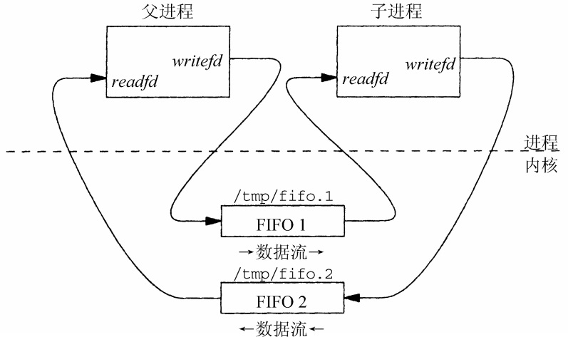

##### 01 命名管道

```c
//read.c:读FIFO
#include<sys/types.h>
#include<sys/stat.h>
#include<stdio.h>
#include<fcntl.h>
#include<unistd.h>
#include<stdlib.h>
#define FIFO_FILE "/oem/myfile/fifo_file"
int main()
{
    int fd;
    char str[10] = {0};
    fd = open(FIFO_FILE,O_RDONLY);
    read(fd,str,5);
    printf("%s\n",str);
    close(fd);
    return 0;
}
```

```c
//write.c:写FIFO
#include<sys/types.h>
#include<sys/stat.h>
#include<stdio.h>
#include<fcntl.h>
#include<unistd.h>
#include<stdlib.h>
#define FIFO_FILE "/oem/myfile/fifo_file"
int main()
{
    int fd,ret;
    char str[10] = {"Hello"};
    //中创建FIFO文件
    ret = mkfifo(FIFO_FILE,0666);
    //只写方式打开
    fd = open(FIFO_FILE,O_WRONLY);  
    write(fd,str,5);
    close(fd);

    return 0;
}
```

> `wanqiu:`:nail_care:
>
> 命名管道存储在系统内核，那么为什么在磁盘也会看到命名管道文件（如上述代码中`"/oem/myfile/"`路径下会看到名为`fifo_file`的管道文件？

------

命名管道是一种特殊的文件类型，用于在进程之间传递数据。在 `POSIX` 标准中，命名管道可以通过文件系统接口进行访问和操作。**命名管道文件在磁盘上是存在的，但它们的数据并不存储在磁盘上。**
在 Linux 系统中，命名管道文件被视为一种**伪文件**（pseudo-file，虚拟文件），它们是通过内存缓冲区来实现的。**当进程写入命名管道时，数据被存储在内核内存中的缓冲区中。当另一个进程从命名管道中读取数据时，数据从内核缓冲区传递给读取进程。这种方式避免了数据在磁盘上的存储和读取，提高了数据传输的效率。**
尽管命名管道文件在磁盘上是可见的，但它们的数据并不存储在磁盘上。**命名管道文件只是通过文件系统接口提供了对管道的访问和操作。**当在磁盘上看到命名管道文件时，实际上是在查看与命名管道相关的元数据信息，如文件名、权限等。

与匿名管道不同，命名管道通过在文件系统中创建一个特殊的文件来表示管道。这个文件在磁盘目录中是可见的，并且**在进程结束后仍然存在，除非显式地删除它**。匿名管道文件只能在创建它们的进程存在期间使用。一旦创建进程终止，管道文件也将被自动删除，并释放相关的资源。


​																												匿名管道（《Unix网络编程卷2》）




​																												命名管道（《Unix网络编程卷2》）